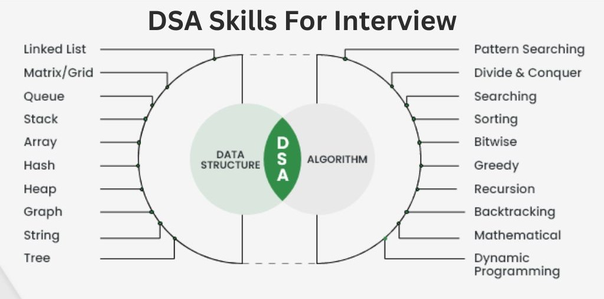

---

Change repo to public : https://github.com/Megha1001/NextStep/settings 
go to danger zone -> change visibility

## 🎯 Goals of This Repository

- Build **strong DSA fundamentals**
- Understand **problem-solving patterns**
- Prepare for **FAANG / Product-based interviews**
- Maintain a **quick revision handbook**
- Cover **System Design (HLD & LLD)** concepts

---

## 📊 Sorting Algorithms Comparison Chart

| Algorithm      | Best Time | Avg Time | Worst Time | Space | Stable | In-Place |
|---------------|-----------|----------|------------|-------|--------|----------|
| Bubble Sort   | O(n)      | O(n²)    | O(n²)      | O(1)  | Yes    | Yes      |
| Selection Sort| O(n²)     | O(n²)    | O(n²)      | O(1)  | No     | Yes      |
| Insertion Sort| O(n)      | O(n²)    | O(n²)      | O(1)  | Yes    | Yes      |
| Merge Sort    | O(n log n)| O(n log n)| O(n log n)| O(n)  | Yes    | No       |
| Quick Sort    | O(n log n)| O(n log n)| O(n²)     | O(log n)| No   | Yes*     |
| Heap Sort     | O(n log n)| O(n log n)| O(n log n)| O(1)  | No     | Yes      |
| Counting Sort | O(n+k)    | O(n+k)   | O(n+k)    | O(k)  | Yes    | No       |
| Radix Sort    | O(nk)     | O(nk)    | O(nk)     | O(n+k)| Yes    | No       |
| Tim Sort      | O(n)      | O(n log n)| O(n log n)| O(n)  | Yes    | No       |

---

## 🧭 Recommended DSA Learning Order

| Step | Topic |
|----|------|
| 1️⃣ | Mathematics |
| 2️⃣ | Arrays |
| 3️⃣ | Searching |
| 4️⃣ | Sorting |
| 5️⃣ | Recursion |
| 6️⃣ | Bit Manipulation |
| 7️⃣ | Hashing |
| 8️⃣ | Stack & Queue |
| 9️⃣ | Linked List |
| 🔟 | Trees |
| 1️⃣1️⃣ | Binary Search Trees |
| 1️⃣2️⃣ | Heaps |
| 1️⃣3️⃣ | Graphs |
| 1️⃣4️⃣ | Dynamic Programming |
| 1️⃣5️⃣ | System Design |

---

## 🛠 Tech Stack

- **Language:** Java
- **IDE:** VS Code
- **Paradigm:** Object-Oriented Programming
- **Focus:** Interview-oriented problem solving

---

## 📝 How to Use This Repo

- 📖 Read & understand implementations
- ✍️ Modify code & test edge cases
- 🔁 Revise using `to_revise`
- ⭐ Track weak areas in `to_visit`
- 📓 Add theory notes in `Algorithms/Notes.txt`

---

## 🌱 Future Enhancements

- [ ] Linked List
- [ ] Stack & Queue
- [ ] Trees & BST
- [ ] Graph Algorithms
- [ ] Dynamic Programming
- [ ] Design case studies

---

## 🏁 Final Note

> **Consistency beats intensity.**  
> Build daily, revise often, and keep pushing forward 🚀

Happy Coding! 💻
