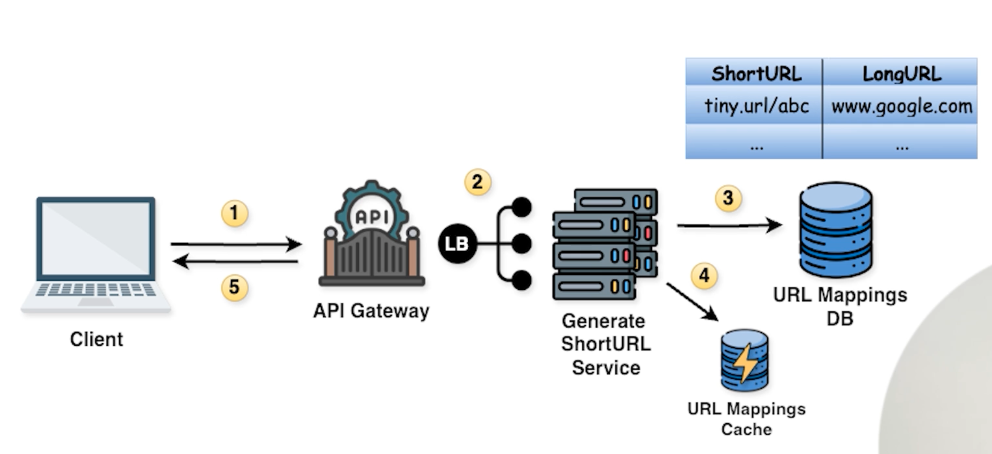
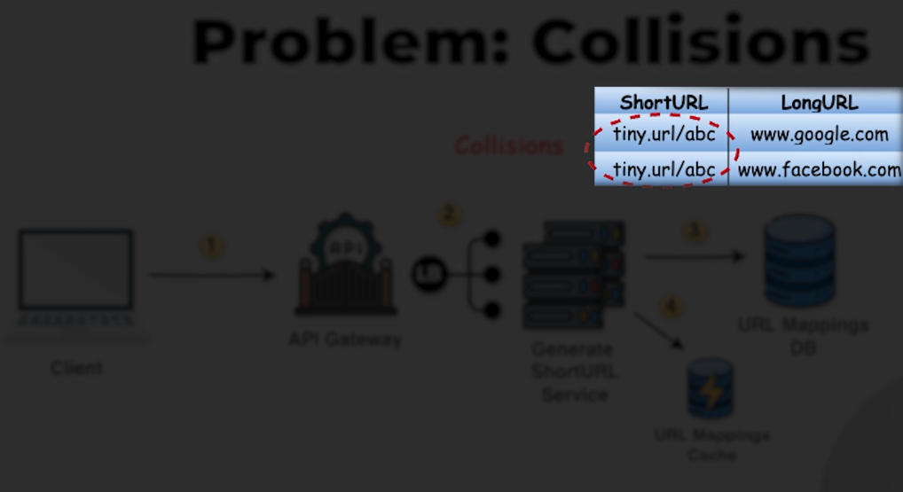
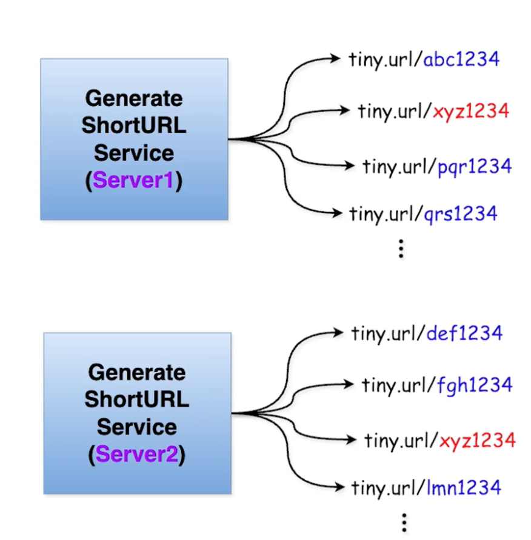
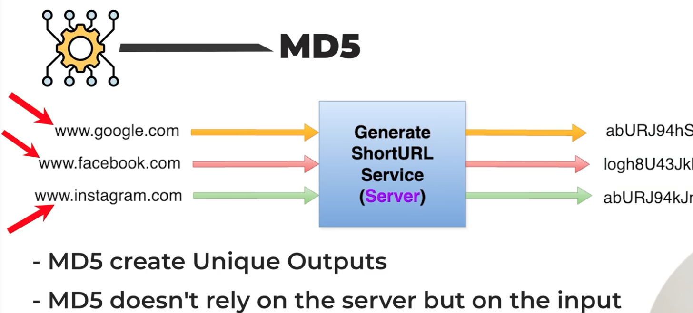
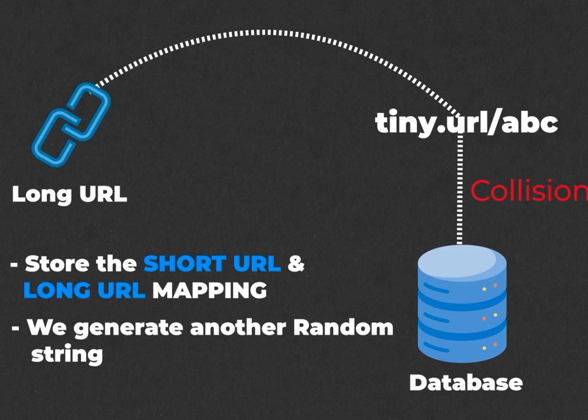
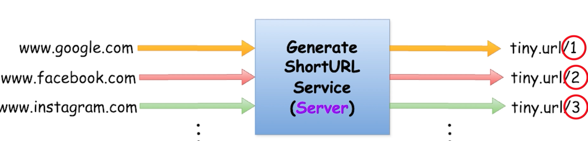
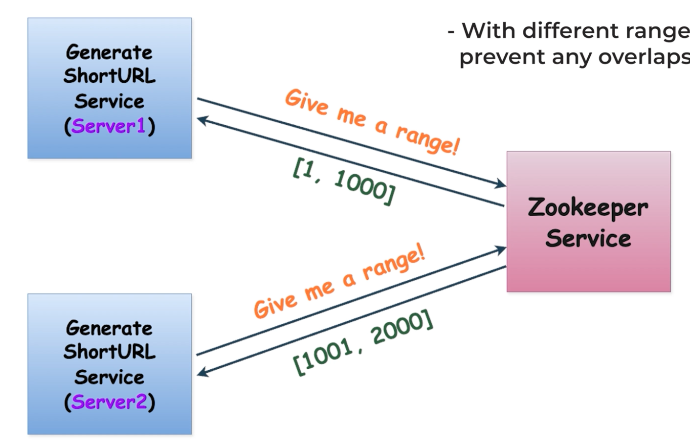

# Design a Tiny URL High-Level Design (HLD)

## Requirements

URL Shortner : Its a service that takes a long URL and convert it into short, compact URL that redirects to the original long URL.

Advantages
- Easy to share
- Characters limits
- Clean and professional

### Functional Requirements
- To generate a short URL
- To get the long URL back

### Non-Functional Requirements
- Availability
- low latency
- Scalability

## Capacity Estimations

### DAU & MAU
    DAU : 300M
    MAU : 1B

### Throughput
- Read Throughput
    - Client reads the original long URL back
        - 300M * 20 (assumption each user requesting 20 long url) = 6B/day get URL request par day

- Write Throughput
    - Creating a short URL
    - 10% of daily active users will create a shortURL
        - 300M * 0.10 = 30M/day
        - Assume every user create 5 short URL = 5 * 30M/day = 150M/day = 150M url creation in one day

### Storage
- When the user send the request to convert short URL to long URL the mapping of short to long is saved in the backend
- Size of Mapping(Short URL to long URL mapping ) = 100Bytes(long URL) + 30 bytes(short URL) + 70Bytes(for metadata - timestamp, userInfo) = 200Bytes
    - 150M * 200Bytes = 30GB/day

### Memory
- Referring to cache memory
    - We store = 30GB/day 
    - 5% of total storage = 1.5GB/day

### Network and bandwidth
- Ingress : Data flowing into our system
    - 30GB/day = 30GB/(24 * 60 * 60) = 30*1000MB/(24 * 60 * 60) = 300MB/(24 * 6 * 6) = 0.35MB/sec
- Egress : Data flowing out of our system
    - When user ask for the long URL
        - 6B/day * 200Bytes = 1200GB/day = 1200GB/(24 * 60 * 60) = 12000MB/(24 * 6 * 6) = 13.8MB/sec

## API DESIGN
- Generating a short URL

- Getting back long URL with short URL
    - EndPoint : /{shortURL} : because this is the endpoint we are typing in the browser
    

## HLD
- Generating a short URL 
    
    - Problem Collision
        
        - Approach 1 : Generate random string with help of algorithm
            - But in this two server can generate same url
            
        - Approach 2 : Generate random string using LongURL
            - Use MD5(base on input create unique outputs)
            - Doesn't rely on the server but on input
            - So, if we input two long URL MD5 will gurantee to generate unique output
            
            - MD5 generates a unique string but it outputs a long String
        - Approach 3 : Check DB for collision
            - For the generated URL go and check in DB. If present, generate another URL
            
            - It does solve our problem but every time collision happens we need to check DB
            - As our system scales the chances of collision will increate and we spend more time in checking and regenerating this would make our system slow in context of high scale
            - Also it goes against our requirement of low latency
        - Approach 4 : Lets keep counters
            - On different server it wont work for this server should communication - that's where zookeeper comes in
                - Zookeeper solves the problem of coordination b/w servers
            
            
        - Approach 5 : Base 62 encoding
            - If we keep counter approach with zookeeper the length of our url grows as scale grows
                - tiny.url/1, tiny.url/100, tiny.url/83434, .....,tiny.url/122423423434
                - So what can we do to keep the URL short - Base 62 Encoding
                    - Right now, each digit is in (0-9) = Base 10 
                    - Expand the number of characters
                        - Numbers(0-9)
                        - UpperCase letters(A-Z)
                        - LowerCase letters(a-z)
                        Total = 10 + 26 + 26 = 62
                        BASE 62 : Giving our number system a major upgrade
                        - By this we can create much shorter URLs that represent the same number
                - We get way more possibilites and combinations with single character
                - 7 characters = 62^7
                    - Every character will have 62 possibility instead of 10 possibility