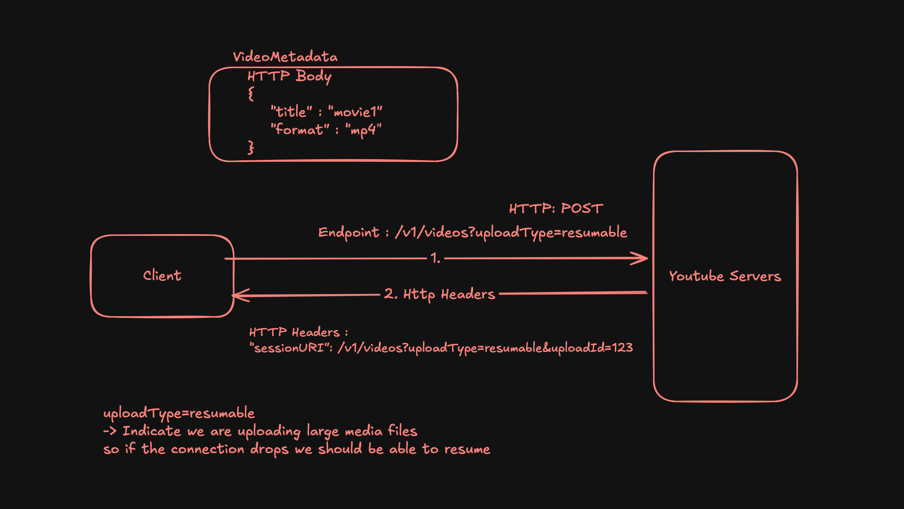
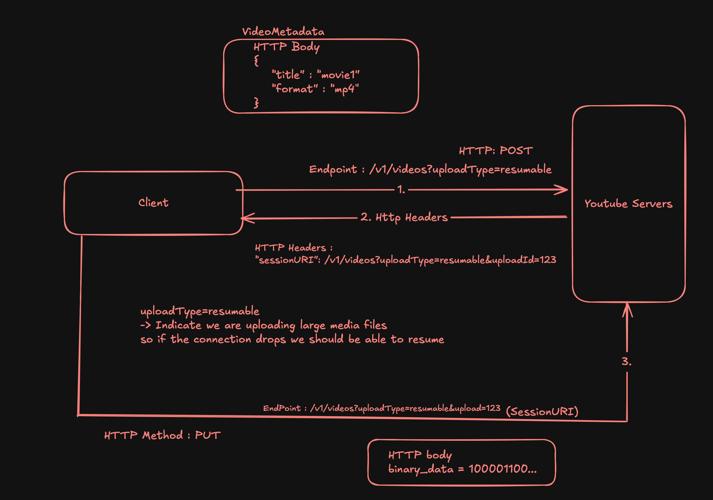
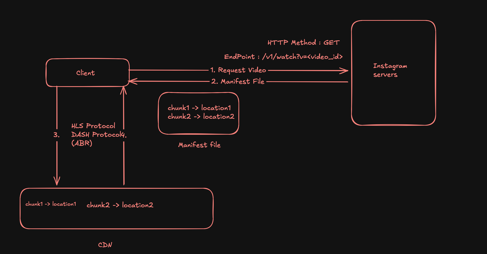
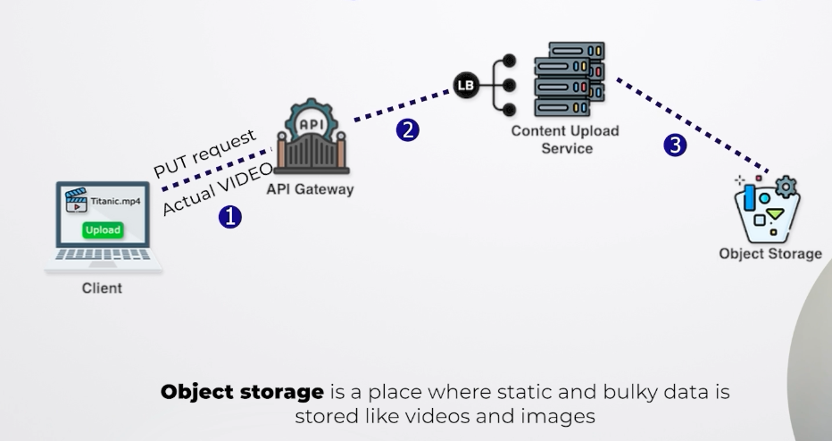

# Youtube High-Level Design (HLD)

## Requirements

### Functional Requirements
Two types of users
- Viewers
    - Can Stream any video (The viewer is able to watch videos.)
    - Device Compatibility (Can stream on mobilies, laptops, computers etc)
- Content Creators
    - Can upload a video
    - Get notification of video upload

### Non-Functional Requirements
- Viewers
  - Low latency - No more wait time, no buffering, no lagging
  - Scalability
  - User Experience -> ABR (Adaptive bit rate)
  - Availability - Should be available 99.9999%

- Content Creators
    - Sclability : The platform should be able to handle numerous creator
    - Security : Nobody should have unauthorized access to those videos, should not be any piracy
    - Storage reliability : For example, it should not happen if creator upload something and it disappears

## Capacity Estimation

### DAU/MAU
- DAU : 100Million Users
- MAU : 2.5Billion Users

### Throughput
- Read Throughput
    - User watch video
        - Assumption : 1 User watch 10 Videos
        - 100M * 10 : 1B read request/day
- Write Throughput
    - Uploading video : 
        - Assumption : 1/250 upload a video
        - 100M/250 = 0.4Million write request/day

### Storage
- Mainly store the video data -> Metadata, video Content
- Assumption : Avg size of video upload : 600MB
    - 600MB * 0.4Millioin = 240TB/day
    - Since video stores for longer period of time we cant delete them immedietly
        - How much storage we need to 10 years
            - 240TB * 365 * 10 = 876PB

### Memory
- When we talk about memory what we mean is we are estimating cache memory
- For this, we need to make assumption of some % out of total storage
    - Assumption : 1% of storage : 2.4TB/day (Since the cost to store data in cache is pretty expensive. Hence, we took percentage like 1%, 3% or 5%)

### Network and Bandwidth estimation
- How much data flows in and out of our system per second
- Its different from throughput
    - In throughput we check how many request flowed in and out of our system. Here we are talking about data
- Ingress : How much data flows into our system
    - All the data that comes to our system will eventually stores somewhere (uploading req)
        - How much data stores in a day == how much data stores in our system = 240TB/day
            - 240TB/(24 * 60 * 60) = 2.7GB/sec
- Egress : How much data flows out of our system
    - How much data read from our system - Someone need to read that data -> Viewers
        - 1B read request/day * 600MB(1 video avg size) = 600PB/day = 600PB/(24 * 60 * 60) = 6.9TB/sec

## API Design
- Upload Content
    - the video that the client is trying to upload can be very very big (can be 10 mins or 2 hours). Not feasible to upload a view in single request
    - Multiple request are used to send video data in small chunks + video metadata
    - Two parts
        - When user clicks upload button 
            - A request send to youtube server asking to upload the metadata
            
            - Use session URI to upload the video
            
            Note : PUT is used to update an existing resource, POST is used to create new resource
            PATCH is use for updating part of existing resource, PUT is used to updata the entire resource
- Streaming/Watching content
    - Multiple request are send to get the each chunk of video and all these chunks are stored at different location
    - So to stream the entire video client needs to know the location
    - So what youtube does it send the manifest first on client request
    - Manifest files is the files which has all the locations of these chunks
    

## High Level Design
- Upload a content
    - Step1 : Video metadata reques and server respond with sessionURI
    
    

- Streaming a content
