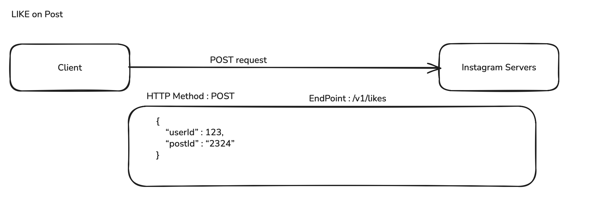
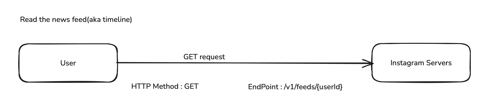
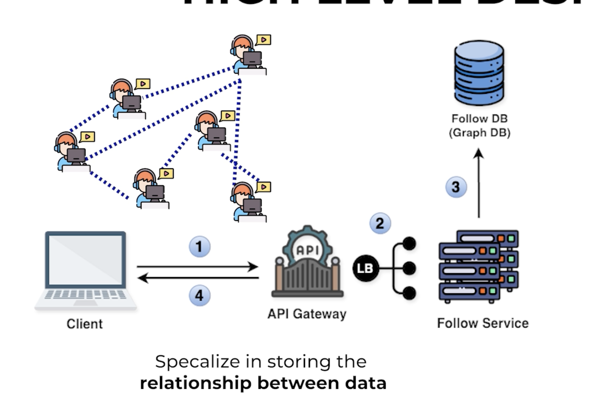

# Instagram High-Level Design (HLD)

## Requirements

### Functional Requirements

- Create a post
  - Image post
  - Video post
  - Text post
- Follow / Unfollow users
- News Feed
  - Show posts of users that a person follows
  - Posts should be in reverse chronological order (most recent to oldest)
- Like posts
- Comment on posts
- Notifications

### Non-Functional Requirements (Availability / Scalability)

- News Feed System
  - Availability
    - The system should be highly available
    - Target uptime: 99.999%
  - Eventual Consistency
    - New posts may not appear immediately
    - Posts should appear within 1–2 seconds
  - Latency
    - Low latency is required
    - News feed should load within 1–2 seconds after clicking Home
  - Scalability
    - The system should scale globally
  - Extensibility
    - The system should be easy to extend in the future
    - Examples: replying to comments, post recommendations, IoT ads
  - Usability
    - News feed rendering should be very fast
    - Focus on good user experience

## Capacity Estimation

### Key Areas

- Daily Active Users (DAU)
- Monthly Active Users (MAU)
- Throughput
- Storage
- Memory
- Network

### User Metrics

- DAU: 500M
- MAU: 2B

### Throughput

- Read Throughput
- Write Throughput

#### Write Throughput

- Writing data to the system
    - Creating a post
    - Following
    - Like/comment

    Estimate on heaviest one -> creating a post
    - 10% of DAU post/day = 50M Users => 50M create post request in a day

- Read Throughput
    - News Feed
        Suppose Users Open news feed 10times a day and each time they see 10 post = 10*10 = 100post/day
    Estimation
        500M/day * 100 post = 50BPost/day

### Storage
- What are we trying to store ?
    -> Post 
        Total Storage = size * number of posts in day

        -> Video Post 
            -> Assumption
                - Average size of post - 20MB
                -  % of each post - 20%
                Storage =  0.2 * 50M *20MB = 200TB/day
        -> Image Post 
            -> Assumption 
                - Average size of post - 0.5MB
                -  % of each post - 60%
                Storage = 0.6 * 0.5MB * 50M = 15TB/day
        -> Text Post 
            -> Assumption
                - Average size of post - 100KB
                -  % of each post - 20%
                Storage = 0.2 * 100KB * 500M = 20KB * 500M = 1TB/day

        Total : 216TB/day

### Memory
- Cache Memory : Amount of cache memory required every day ?
    Assumption : 1% of storage = 0.01 * 216TB/day = 2.16TB/day

### Network Or Bandwidth Estimation
- How much data flows into and out of our system per second
    - Data flowing into our system per second also known as - Ingress
    - Data flowing out of our system per second also known as egress

- Ingress calculation
    - It should be store somewhere in our system -> Storage = 216TB/day
        In sec = 216TB / (24* 60 *60) = 2.5GB

- Egress calculation
    - It should be data read from our system
        From Throughput estimation = 50BPost/day
        Average size of post = (0.2*100KB)[text post] + (0.6 * 0.5MB)[Image post] + (0.2 * 20MB)[Video post] = 4.32MB

        Amount of data going out of our system = 50B read request * 4.32MB = 216PB/day
        In sec 216PB/(24 * 60 * 60)  = 2.5TB/sec

### API Design

- Text Post
    

- Image/Video Post
    

- Comment Post
    

- Like Post
    

- Follow/Unfollow User
    

- NewFeed(aka timeline)
    

### High level Design

- FOllow/ Unfollow
    